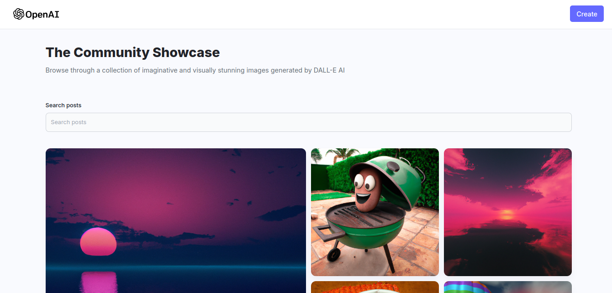

# AI Image Generation App 🖼️
Turning creative prompts into visually capivating artworks 🎨

## Preview


## Technologies used

- [**Vite**](https://vitejs.dev/) + [**React**](https://reactjs.org/): Fast and lightweight development environment and framework for building modern web applications.
- [**MERN Stack**](https://www.mongodb.com/mern-stack):
  - [**MongoDB**](https://www.mongodb.com/): A NoSQL database for storing data.
  - [**Express**](https://expressjs.com/): A minimal and flexible Node.js web application framework.
  - [**Node.js**](https://nodejs.org/): A JavaScript runtime built on Chrome's V8 JavaScript engine for server-side programming.
- [**Cloudinary**](https://cloudinary.com/): A cloud-based service for image and video management.
- [**OpenAI DALL·E**](https://www.openai.com/dall-e): An AI model that generates images from textual descriptions.


## Table of Contents

- [Prerequisites](#prerequisites)
- [Installation](#installation)
- [Configuration](#configuration)
- [Usage](#usage)
- [Deployment](#deployment)
- [Contributing](#contributing)
- [License](#license)

## Prerequisites

Before you begin, ensure you have the following prerequisites:

- Node.js and npm installed.
- MongoDB Atlas account for database storage.
- Cloudinary account for image storage.
- OpenAI API key for DALL·E.

## Installation

1. **Clone the repository**
```bash
git clone https://github.com/kamalj57/Dall-E.git
```
2. **Install the necessary dependencies**
```bash
npm install
```
## Configuration
1. **Frontend Configuration**

- Create a `.env file` in the client directory
```env
 VITE_REACT_APP_API=Deployed WebserviceURL  # Update with your server
```

2. **Server Configuration**

- Create a `.env file` in the server directory.
```env
PORT=8080
MONGODB_URI=your_mongodb_uri    # Update with your MongoDB Atlas connection URI
CLOUDINARY_CLOUD_NAME=your_cloudinary_cloud_name  # Update with your Cloudinary cloud name
CLOUDINARY_API_KEY=your_cloudinary_api_key   # Update with your Cloudinary API key
CLOUDINARY_API_SECRET=your_cloudinary_api_secret  # Update with your Cloudinary API secret
OPENAI_API_KEY=your_openai_api_key  # Update with your OpenAI API key
```
## Usage
1.**Start the server**
```bash
cd server
```
```bash
nodemon index
```
2. **Start the frontend**
```bash
cd client
```
```bash 
npm run dev
```
Visit http://localhost:5173 in your browser to access the application.

## Deployment
Follow your preferred deployment method to deploy the application. Ensure to set the environment variables for production in your deployment environment.

## Contributing
Contributions are welcome! Feel free to open issues and pull requests.

## License
This project is licensed under the MIT License.
Make sure to replace placeholder values (like `your_mongodb_uri`, `your_cloudinary_cloud_name`, `your_cloudinary_api_key`, `your_cloudinary_api_secret`, and `your_openai_api_key`) with your actual credentials.
